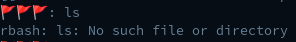
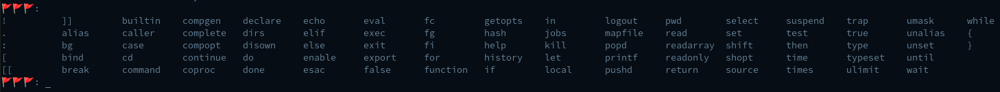
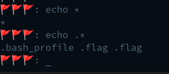
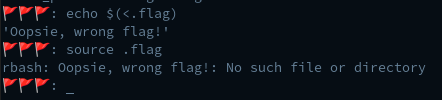
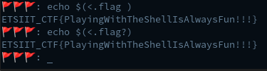

# Lost Flag: Write-up

> ¡Hola! ¿Podrías ayudarme a encontrar la flag que se me ha perdido en el servidor? Accede por SSH a la dirección **ctf.hackiit.cf**> y puerto **31418** con el usuario `hackiit` y la contraseña `LSExf8pbM8c8QZXm`.

El objetivo del reto es encontrar una *flag* en el servidor al que se nos da acceso por SSH.

Primero, debemos acceder al servidor (`ssh hackiit@ctf.hackiit.cf -p 31418`).

Una vez dentro, podemos tratar de listar fichero con el comando `ls`, sin embargo, obtenemos el siguiente error.

Analizando el error vemos que estamos en [rbash](https://www.man7.org/linux/man-pages/man1/bash.1.html#RESTRICTED_SHELL), por lo tanto, nuestras posibilidades son limitadas.

El siguiente paso es identificar que herramientas podemos utilizar. Estas deben estar definidas en la variable de entorno `$PATH`, probamos a leerla con el comando `echo $PATH`.

Como podemos comprobar, la variable `$PATH` se encuentra vacía, es decir, no podemos utilizar herramientas que no sean las propias de la *shell*.

Pulsando dos veces el tabulador podemos identificar las herramientas incorporadas en la *shell*.

Usando `echo` podemos tratar de listar los ficheros, primero vamos a listar los ficheros normales `echo *` y posteriormente los ficheros ocultos `echo .*`.

Tras identificar los ficheros, vemos que hay dos ficheros flag. Existen varias formas de leer ficheros con funcionalidades propias de la *shell*, por ejemplo, con `echo` o con `source`.

- `echo $(<.flag)`
- `source .flag`
  

Sin embargo, parece que la *flag* que hemos leído no es la correcta. Analizando el nombre de ambos ficheros, podemos identificar que el segundo fichero posee un carácter invisible al final. Tenemos dos opciones, o copiamos el nombre con ese caracter invisible o bien usamos el signo de interrogación `?` que representa un caractér cualquiera.

- `echo $(<.flag⠀)`
- `echo $(<.flag?)`
  

