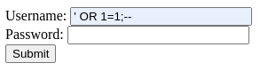
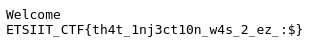

# Description

Name: sqlito

Description: estás tardando

Difficulty: Ez

# Set up

`docker build -t ctf-nosql .`

`docker run -d --rm -p 6001:6001 --name ctf-sql ctf-sql`

# Write up

Visitando la página principal del reto, obtenemos el código fuente. Revisando este código podemos ver que la aplicación Flask tiene una ruta adicional: `/login`, accesible mediante métodos GET y POST.

Navegando a `/login`, el reto nos presenta el formulario de login más feo de la historia, si analizamos el código podemos ver como gestiona los parámetros introducidos por los usuarios.

```python
@app.route('/login', methods=['POST'])
def login():
    username = request.form['username']
    password = request.form['password']
    conn = sqlite3.connect('database.db')
    c = conn.cursor()
    c.execute("SELECT * FROM users WHERE username = '{}' AND password = '{}'".format(username, password))
    user = c.fetchone()
    conn.close()
    if user:
        with open('flag.txt', "r") as f:
            flag = f.read()
        return f'Welcome\n{flag}', 200, {'Content-Type': 'text/plain'}
    else:
        return "Invalid username or password"
```

 Si encuentra un usuario con el `username` y la `password` indicada, nos da la bienvenida y nos proporciona la flag. Vemos que la aplicación ejecuta la siguiente query para validar los datos introducidos y autenticar al usuario o no:

 `SELECT * FROM users WHERE username = 'INPUT' AND password = 'INPUT'`

 Como se puede ver, no se lleva a cabo ningún tipo de sanitización de las inputs ni se hace uso de prepared statements, simplemente se construye la cadena de la query concatenando los datos introducidos.

 Una query normal tendría la siguiente pinta:

 `SELECT * FROM users WHERE username = 'admin' AND password = 'admin'`

 Si la analizamos más de cerca, la aplicación busca en la tabla `users` usuarios que cumplan 2 condiciones, 1. que su `username` sea el indicado en el formulario **Y** 2. que la `password` sea la indicada en el formulario.

 Dado las insuficientes protecciones podemos indicar un payload que modifique la query de tal forma que no tengamos que cumplir esas 2 condiciones mencionadas (es lo que nos interesa ya que a priori no conocemos ni los usuarios existentes ni sus contraseñas).

 Por tanto, el objetivo es bypassear la autenticación y para ello debemos indicar un payload de forma que las condiciones del `WHERE` den un resultado verdadero. Por ejemplo:

 `SELECT * FROM users WHERE username = '' OR 1=1--' AND password = ''`

 Indicando `' OR 1=1--` en el campo de username del formulario transformamos el condicional `AND` en un `OR` que siempre se cumple. `--` comenta el resto de la query haciendo que no se ejecute la parte del `' AND password = ''`.

 
 
 Por tanto, conseguimos que la query devuelva registros de la base de datos y accedemos de forma autenticada a la aplicación, obteniendo la flag.




